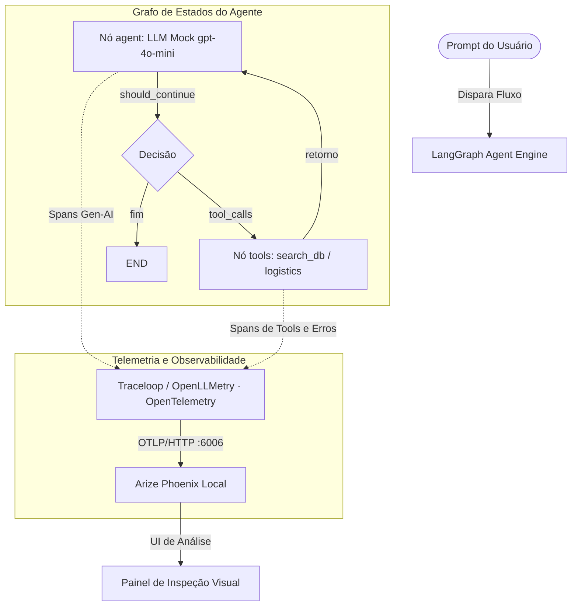

# Grupo G9 — Observabilidade e Tracing em Agentes de IA

Protótipo acadêmico que demonstra, na prática, **instrumentação e observabilidade** em sistemas
baseados em **Agentes de IA**. Um assistente de suporte construído com **LangGraph** é instrumentado
com **OpenTelemetry + OpenLLMetry (Traceloop)** e tem seus traces visualizados no **Arize Phoenix**.

> **Trabalho Final — Sessão de Painéis sobre Agentes de IA** · apresentação em **11/06/2026**.
> Este repositório cobre o **Checkpoint 2** (protótipo funcional) e o **Checkpoint 3**
> (métricas, demo e draft do painel A1). Stack 100% alinhada ao **Checkpoint 1**.

---

## 📌 Estado dos Checkpoints

| Checkpoint | Entrega | Status |
|---|---|---|
| **CP1** — Pesquisa e definição | Tema, escopo, stack, referências | ✅ Entregue |
| **CP2** — Protótipo funcional | Agente LangGraph + tracing + 3 cenários | ✅ Implementado neste repo |
| **CP3** — Refinamento, evals e painel | Métricas, demo e [draft do painel A1](poster/poster.html) | ✅ Neste repo |

---

## 🎯 Objetivo

Pipelines agênticos operam com fluxos **não-determinísticos**. Rastrear o que acontece em tempo de
execução ("abrir a caixa-preta") é vital para:

1. **Identificar gargalos de latência** em chamadas de LLM ou de ferramentas externas.
2. **Mapear erros em ferramentas (tools)**, capturando exceções de forma granular.
3. **Detectar loops repetitivos** que estouram limites computacionais e inflam custos de tokens.

---

## 🏗️ Arquitetura



### Componentes (`app/`)

| Arquivo | Papel |
|---|---|
| [`agent.py`](app/agent.py) | Grafo LangGraph: estado, nós, arestas, `MockChatOpenAI` determinístico e as 2 ferramentas |
| [`tracing.py`](app/tracing.py) | Sobe o Arize Phoenix local e inicializa o Traceloop (OpenLLMetry) exportando OTLP/HTTP |
| [`main.py`](app/main.py) | Orquestra o disparo automático dos 3 experimentos |
| [`collect_metrics.py`](app/collect_metrics.py) | Coleta determinística das métricas → `results/` (não exige instalar a stack) |

- **`MockChatOpenAI`**: modelo de chat (herda de `BaseChatModel`) que emula decisões e tool calls de
  forma determinística conforme o prompt. Gera spans idênticos aos de produção da OpenAI,
  **sem exigir chaves de API** — portabilidade total e custo zero para reproduzir.
- **Ferramenta 1 — `search_customer_db`**: simula consulta ao cadastro/plano do cliente.
- **Ferramenta 2 — `call_logistics_api`**: simula a API de logística; lança um `ValueError`
  controlado se o ID não começar com `#`, ativando a telemetria de erro.

---

## 🚀 Como executar

### Pré-requisitos
- **Python 3.11+**
- Porta **6006** livre (Arize Phoenix)

### 1. Ambiente virtual (recomendado)
```bash
python -m venv venv
# Windows (PowerShell):
.\venv\Scripts\Activate.ps1
# macOS / Linux:
source venv/bin/activate
```

### 2. Dependências
```bash
pip install -r requirements.txt
```

### 3. Variáveis de ambiente
O `.env` já vem configurado para `localhost` (apenas valores **mock**, sem segredos):
```env
OPENAI_API_KEY=mock-key-not-needed
PHOENIX_PORT=6006
PHOENIX_HOST=127.0.0.1
TRACELOOP_BASE_URL=http://127.0.0.1:6006/v1/traces
```

### 4. Rodar os experimentos (com telemetria)
```bash
python app/main.py
```
Sobe o Phoenix, dispara os 3 cenários e mantém o painel disponível em
👉 **http://127.0.0.1:6006** (projeto `agente-suporte-observabilidade`).

### 5. Coletar as métricas consolidadas (sem instalar a stack)
```bash
python app/collect_metrics.py
```
Gera os resultados quantitativos em [`results/`](results/) — útil para o painel e o README.

---

## 🧪 Os 3 cenários induzidos

| Cenário | Prompt (resumo) | O que acontece | Na UI do Phoenix |
|---|---|---|---|
| **1 · Sucesso** | "…cadastro da Ana Silva e rastrear o último pedido" | Encadeia `search_customer_db` → `call_logistics_api(#9834)` → resposta final | Árvore de spans completa e aninhada |
| **2 · Falha controlada** | "…rastreie o pedido **9901**" (sem `#`) | `call_logistics_api` lança `ValueError` tratado pelo agente | Span **vermelho (ERROR)** com stack trace |
| **3 · Loop repetitivo** | "Gere um comportamento de **loop**…" | Decisão cíclica até `recursion_limit=5` → `GraphRecursionError` | Timeline com padrão repetitivo até o corte |

---

## 📊 Resultados quantitativos

Gerados por [`app/collect_metrics.py`](app/collect_metrics.py) (ver [`results/metrics.md`](results/metrics.md)).
Contagens estruturais são **exatas**; tokens, latência e custo são **estimativas** (LLM mockado).

| Cenário | Spans | LLM | Tools | Erros | Passos | Tokens* | Latência* | Custo* (USD) |
|---|:--:|:--:|:--:|:--:|:--:|:--:|:--:|:--:|
| Sucesso | 6 | 3 | 2 | 0 | 5 | 947 | 2,2 s | $0,000215 |
| Falha controlada | 4 | 2 | 1 | 1 | 3 | 526 | 1,4 s | $0,000111 |
| Loop repetitivo | 6 | 3 | 2 | 0 | 5 | 867 | 2,1 s | $0,000177 |
| **TOTAL** | **16** | **8** | **5** | **1** | **13** | **2340** | **5,7 s** | **$0,000503** |

<sub>(*) Estimativas — heurística ~4 chars/token e preços públicos do GPT-4o-mini (US$ 0,15 / 0,60 por 1M tokens de entrada/saída). Premissas detalhadas em [`results/metrics.md`](results/metrics.md).</sub>

Gráficos: [tokens por cenário](results/tokens_chart.svg) · [latência por cenário](results/latency_chart.svg).

---

## 🎬 Demo

https://github.com/nicolaskms/observability-tracing/raw/main/docs/demo.mp4

> Demo gravada localmente: terminal com os 3 cenários executando + navegação pelas traces no Arize Phoenix.
> Roteiro detalhado em [`docs/README.md`](docs/README.md).

| Sucesso (árvore de spans) | Erro (span vermelho) |
|---|---|
|  |  |

---

## 🖼️ Painel A1 (Checkpoint 3)

Draft do painel acadêmico, no padrão de 6 blocos da disciplina (A1 retrato, fonte do corpo ≥ 24 pt):

- **Arquivo:** [`poster/poster.html`](poster/poster.html)
- **Exportar PDF:** abrir no Chrome/Edge → `Ctrl+P` → *Salvar como PDF*, papel **A1**, margens *Nenhuma*.
  Passo a passo em [`poster/README.md`](poster/README.md).

---

## 📁 Estrutura do projeto

```
observability-tracing/
├── app/
│   ├── agent.py            # Grafo LangGraph + tools + LLM mock
│   ├── tracing.py          # Arize Phoenix + Traceloop (OpenLLMetry)
│   ├── main.py             # Dispara os 3 experimentos (com telemetria)
│   └── collect_metrics.py  # Métricas determinísticas → results/ (stdlib puro)
├── poster/
│   ├── poster.html         # Painel A1 (draft do Checkpoint 3)
│   └── README.md           # Como exportar o PDF A1
├── results/                # Saídas de collect_metrics.py (json, md, svg)
├── docs/                   # Demo (GIF/vídeo) e screenshots do Phoenix
├── requirements.txt
├── .env                    # Config local (valores mock, sem segredos)
└── README.md
```

---

## 🔧 Stack técnica (alinhada ao Checkpoint 1)

Python 3.11+ · LangGraph · LangChain Core · OpenTelemetry · OpenLLMetry (Traceloop) ·
Arize Phoenix (local) · OpenAI GPT-4o-mini / Ollama Llama 3.

> **Nota de escopo:** o protótipo inicial (Node.js/Express + Jaeger via Docker) foi **substituído**
> pela stack Python do Checkpoint 1. Arquivos legados (`docker-compose.yml`, `observability/jaeger/`,
> `backend/`) foram removidos para manter o repositório aderente ao escopo aprovado.

---

*Desenvolvido pelo Grupo G9.*
