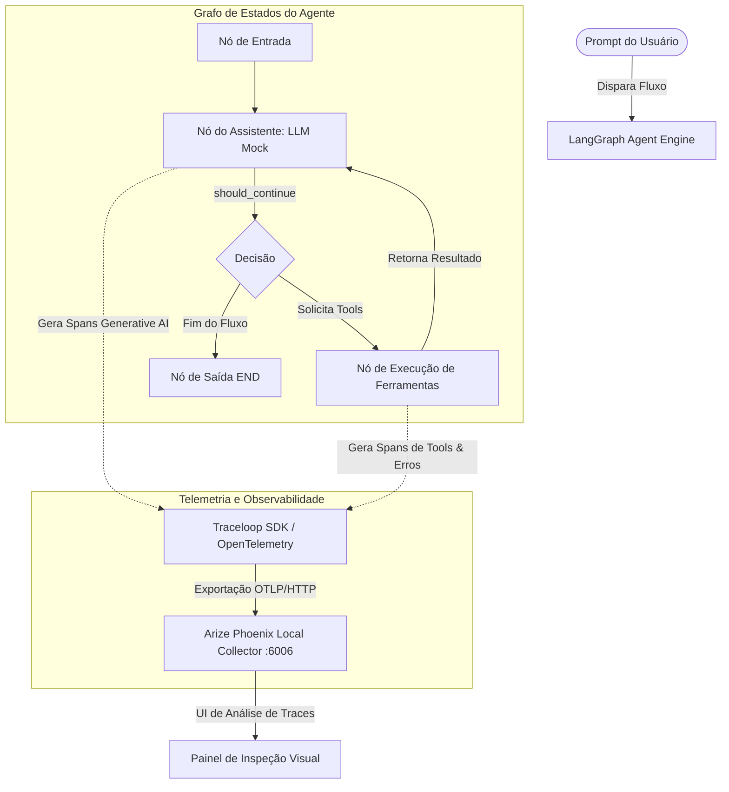

# Grupo G9 - Observabilidade e Tracing em Agentes de IA (Alinhamento Checkpoint 1 & 2)

Este repositório contém o protótipo acadêmico desenvolvido para demonstrar, de forma prática, a instrumentação e observabilidade em sistemas inteligentes baseados em **Agentes de Inteligência Artificial**. 

Em alinhamento total com as especificações do **Checkpoint 1**, o projeto foi totalmente reestruturado em **Python** utilizando **LangGraph** para orquestração de estados, **Arize Phoenix** para visualização local de telemetria e **OpenLLMetry (Traceloop)** para padronização de traces e geração automática de spans Generative AI.

---

## 🎯 Objetivo do Projeto

Sistemas multiagentes e pipelines de decisão agênticos operam com fluxos de execução não-determinísticos. Rastrear o que ocorre em tempo de execução ("abrir a caixa-preta") é vital para:
1.  **Identificar gargalos de latência** em chamadas de LLM ou chamadas de ferramentas externas.
2.  **Mapear erros e falhas em ferramentas (Tools)** capturando exceções de forma granular.
3.  **Detectar loops repetitivos** (loops de retroalimentação) que estouram limites computacionais ou geram custos inflados de tokens.

---

## 🏗️ Arquitetura e Funcionamento

### Visão Geral do Sistema



### Componentes do Projeto (`app/`)

*   `app/agent.py`: Define a estrutura do assistente automatizado via **LangGraph**:
    *   **Estado (`AgentState`)**: Sequência acumulada de mensagens.
    *   **LLM Mock (`MockChatOpenAI`)**: Um modelo de chat personalizado integrado ao LangChain que emula de forma determinística as tomadas de decisões e chamadas de ferramentas dependendo do prompt, gerando traces idênticos a chamadas de produção da OpenAI. **Não requer chaves de API**, garantindo portabilidade de execução sem custos.
    *   **Ferramenta 1 (`search_customer_db`)**: Simula consulta ao cadastro e plano do cliente no banco de dados.
    *   **Ferramenta 2 (`call_logistics_api`)**: Simula chamada de logística. Lança um erro controlado (`ValueError`) caso o formato do ID não esteja em conformidade (exemplo sem o prefixo `#`), ativando a telemetria de erro.
*   `app/tracing.py`: Inicializa o servidor do **Arize Phoenix** localmente e acopla a instrumentação do **Traceloop (OpenLLMetry)** para exportar dados OTLP/HTTP para a porta local `6006`.
*   `app/main.py`: Script que orquestra o disparo automático dos três experimentos propostos no Checkpoint 1.

---

## 🚀 Como Executar o Projeto

### Pré-requisitos
*   **Python 3.11** ou superior instalado na máquina.
*   Porta `6006` liberada (usada pelo Arize Phoenix).

### 1. Preparar o Ambiente

Crie e ative um ambiente virtual Python (opcional, mas altamente recomendado):

```bash
# Criar ambiente virtual
python -m venv venv

# Ativar ambiente virtual
# No Windows (CMD / PowerShell):
.\venv\Scripts\activate
# No macOS / Linux:
source venv/bin/activate
```

### 2. Instalar Dependências

Instale os pacotes necessários definidos no `requirements.txt`:

```bash
pip install -r requirements.txt
```

### 3. Configurar Variáveis de Ambiente

O projeto já inclui um arquivo `.env` configurado com os valores de localhost ideais. Caso queira modificar a porta do Phoenix ou hospedar remotamente, edite o arquivo `.env`:

```env
OPENAI_API_KEY=mock-key-not-needed
PHOENIX_PORT=6006
PHOENIX_HOST=127.0.0.1
TRACELOOP_BASE_URL=http://127.0.0.1:6006/v1/traces
```

### 4. Executar os Experimentos

Rode o arquivo de testes principal. Ele iniciará o painel do Phoenix e executará as três simulações em sequência:

```bash
python app/main.py
```

---

## 🧪 Experimentos Executados e Resultados Visualizados no Phoenix

Ao executar o script, os três cenários de testes induzidos definidos no Checkpoint 1 são processados:

### Experimento 1: Execução Bem-Sucedida
*   **Prompt**: "Olá, pode verificar o status do cadastro da Ana Silva e rastrear o último pedido dela?"
*   **Fluxo**: O agente consulta a ferramenta de banco de dados (`search_customer_db`), localiza o ID do último pedido (`#9834`), aciona a API de logística (`call_logistics_api`) para rastrear o pacote e exibe a resposta consolidada de sucesso ao usuário.
*   **Exibição no Phoenix**: Visualização de uma árvore de spans completa contendo a hierarquia de chamadas, latência de cada etapa, chamadas de tools de forma aninhada, metadados e parâmetros passados a cada função.

### Experimento 2: Falha Controlada na Tool
*   **Prompt**: "Por favor, rastreie o status de entrega do pedido 9901" *(Nota: sem o caractere `#` obrigatório)*
*   **Fluxo**: O agente chama a ferramenta de logística passanddo o argumento `"9901"`. A ferramenta valida o formato e lança um erro controlando do tipo `ValueError`. O agente lida com a exceção e informa amigavelmente o usuário sobre o ocorrido.
*   **Exibição no Phoenix**: O span da ferramenta `call_logistics_api` é destacado em **vermelho (Status: ERROR)** na timeline do Phoenix. Clicando sobre ele, é possível visualizar o Stack Trace completo do erro Python (`ValueError: Erro na API de Logística...`) de forma granular sem que a aplicação tenha quebrado.

### Experimento 3: Comportamento de Loop Repetitivo
*   **Prompt**: "Gere um comportamento de loop nas chamadas de ferramentas para testar o sistema."
*   **Fluxo**: O agente cai em uma tomada de decisão cíclica induzida, tentando consultar a ferramenta de forma infinita. A proteção nativa do LangGraph é ativada por meio do parâmetro `recursion_limit=5`. O grafo de estados atinge o limite e interrompe a execução com um erro de recursão (`GraphRecursionError`).
*   **Exibição no Phoenix**: Linha do tempo mostrando o padrão cíclico e repetitivo de spans se abrindo recursivamente. O trace do Phoenix destaca visualmente onde o limite foi estourado, facilitando a depuração desse padrão prejudicial para sistemas em produção.

---

## 📊 Visualização de Métricas no Phoenix

Após a execução, mantenha o script rodando e acesse:
👉 **[http://127.0.0.1:6006](http://127.0.0.1:6006)**

Na interface web do Phoenix, você terá acesso a:
*   **Árvore de Execução Completa (Traces)**: Navegação visual profunda por cada chamada e fluxo de estado do LangGraph.
*   **Metadados de IA Generativa**: Latência média, consumo de tokens estimado (se usando chaves reais) e status de sucesso/falha de cada nó.
*   **Inspeção de Spans**: Análise de parâmetros de entrada, saídas brutas das funções de banco de dados e logística e rastreamento de exceções capturadas.

---

*Desenvolvido pelo Grupo G9.*
