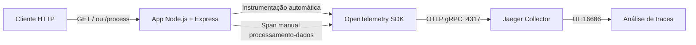

# Grupo G9 - Observabilidade e Tracing em Agentes de IA

Protótipo acadêmico para demonstrar, de forma prática, como instrumentar aplicações Node.js com OpenTelemetry e visualizar traces distribuídos no Jaeger.

## 🎯 Objetivo do Projeto

Sistemas agênticos e pipelines de IA costumam sofrer com o problema de opacidade: sabemos a entrada e a saída, mas não enxergamos claramente o que aconteceu no meio do caminho.

Este repositório valida, em escala de laboratório, como aplicar observabilidade para reduzir esse efeito de caixa-preta por meio de:

- geração automática de spans em requisições HTTP e rotas Express;
- criação de spans manuais para etapas de negócio;
- exportação OTLP/gRPC para backend de observabilidade (Jaeger);
- inspeção visual da timeline, atributos e eventos de execução.

No estado atual do código, o protótipo usa uma API Express (simulação de fluxo de agente) e não contém implementação de LangGraph/OpenLLMetry ainda.

## 🏗️ Arquitetura e Funcionamento

### Visão geral



### Componentes reais do workspace

- `docker-compose.yml`: sobe apenas o Jaeger (`16686`, `4317`, `4318`).
- `app/tracing.js`: inicializa `NodeSDK`, exportador OTLP gRPC e instrumentações HTTP/Express.
- `app/index.js`: API instrumentada com rotas `GET /` e `GET /process`.
- `backend/src/index.js`: backend simples de referência, sem tracing OpenTelemetry.

### Fluxo da aplicação instrumentada (`app/`)

1. O processo inicia com `node --require ./tracing.js index.js`.
2. O OpenTelemetry SDK registra recurso do serviço (`OTEL_SERVICE_NAME`, padrão `api-observability`).
3. Requisições HTTP/Express recebem spans automáticos.
4. Na rota `GET /process`, o código abre um span manual `processamento-dados`.
5. O span manual recebe atributos e evento de conclusão.
6. Os traces são exportados para `OTEL_EXPORTER_OTLP_ENDPOINT` (padrão `http://localhost:4317`).
7. O Jaeger exibe a árvore de spans para análise.

### Sobre LangGraph, nós e ferramentas simuladas

Para manter fidelidade ao código atual:

- Não há grafo LangGraph implementado neste repositório.
- Não há definição de nós de agente/tool-calling no código.
- A ferramenta simulada do protótipo é a própria etapa de negócio da rota `GET /process` (delay + evento + atributos), usada para demonstrar rastreabilidade ponta a ponta.

## 🛠️ Tecnologias Utilizadas

- `Node.js 20` (imagem `node:20-alpine` no Dockerfile da app)
- `Express 4` (API HTTP)
- `OpenTelemetry SDK (Node)`
- `OpenTelemetry API`
- `OTLP Trace Exporter (gRPC)`
- `OpenTelemetry Instrumentation HTTP`
- `OpenTelemetry Instrumentation Express`
- `Jaeger` (coleta e visualização de traces)
- `Docker` e `Docker Compose`
- `dotenv` (carregamento de variáveis de ambiente)

Dependências observadas diretamente em `app/package.json` e `backend/package.json`.

## 🚀 Como Executar o Projeto

### 1. Clonar o repositório

```bash
git clone https://github.com/nicolaskms/observability-tracing.git
cd observability-tracing
```

### 2. Subir o stack de observabilidade (Jaeger)

```bash
docker-compose up -d
```

### 3. Configurar variáveis de ambiente da aplicação

No diretório `app/`, crie um arquivo `.env` (opcional). Exemplo:

```env
OTEL_SERVICE_NAME=api-observability
OTEL_EXPORTER_OTLP_ENDPOINT=http://localhost:4317
PORT=3000
```

Observação: não existe chave de API obrigatória no código atual.

### 4. Instalar dependências da app instrumentada

```bash
cd app
npm install
```

### 5. Rodar a app instrumentada

```bash
npm start
```

### 6. Disparar requisições de teste

```bash
curl http://localhost:3000/
curl http://localhost:3000/process
```

### 7. Visualizar traces no Jaeger

1. Acesse: `http://localhost:16686`
2. Selecione o serviço `api-observability`
3. Clique em **Find Traces**

### Execução alternativa do backend simples (`backend/`)

Este serviço não está instrumentado com OpenTelemetry no estado atual, mas pode ser executado para comparação:

```bash
cd backend
npm install
npm start
```

## 🧪 Cenários de Teste Induzidos

### 1) Execução Bem-Sucedida

Objetivo: validar captura e visualização de trace completo.

Passos:

```bash
docker-compose up -d
cd app
npm install
npm start
```

Em outro terminal:

```bash
curl http://localhost:3000/process
```

Resultado esperado:

- resposta HTTP `200` com `Processamento concluído com sucesso`;
- trace visível no Jaeger para `api-observability`;
- presença do span manual `processamento-dados` com atributos/evento.

### 2) Falha Controlada

Objetivo: simular falha no envio de telemetria sem derrubar a API.

Opção recomendada: iniciar a app com endpoint OTLP inválido.

PowerShell (Windows):

```powershell
cd app
$env:OTEL_EXPORTER_OTLP_ENDPOINT="http://localhost:9999"
npm start
```

Disparo:

```bash
curl http://localhost:3000/process
```

Resultado esperado:

- API segue respondendo normalmente;
- traces não chegam ao Jaeger;
- logs indicam problema de exportação/conectividade OTLP.

### 3) Loop Repetitivo

Objetivo: gerar múltiplos traces em sequência para observar padrão repetitivo e volume.

Bash:

```bash
for i in {1..10}; do curl -s http://localhost:3000/process > /dev/null; done
```

PowerShell:

```powershell
1..10 | ForEach-Object { Invoke-RestMethod "http://localhost:3000/process" | Out-Null }
```

Resultado esperado:

- 10 traces novos para a rota `/process`;
- visão clara de repetição temporal no Jaeger;
- possibilidade de comparar duração e consistência dos spans.

---

Projeto acadêmico do Grupo G9, focado em fundamentos de observabilidade aplicados a sistemas inteligentes e componentes agênticos.
